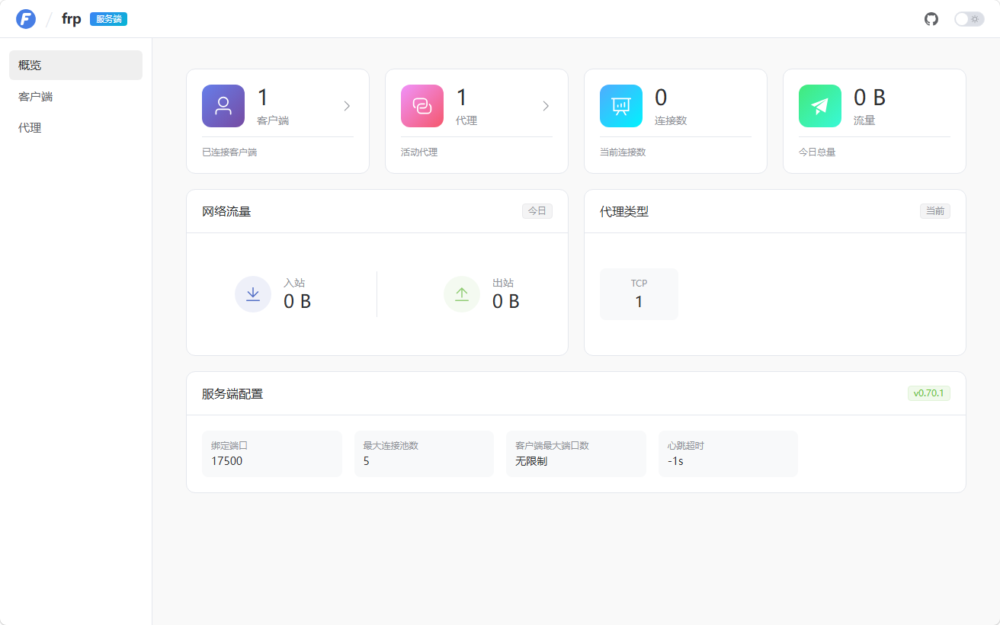
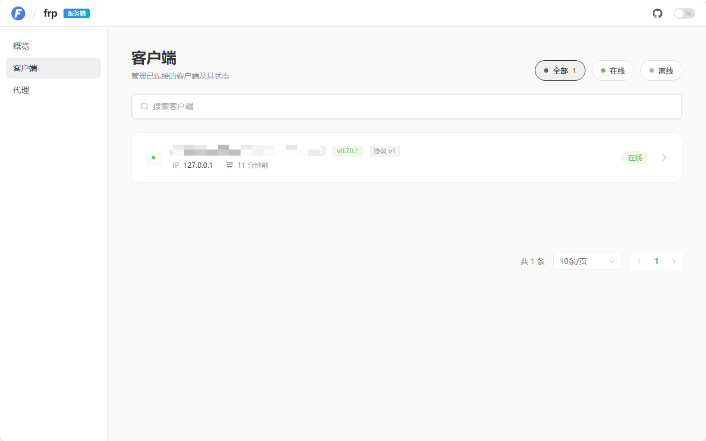
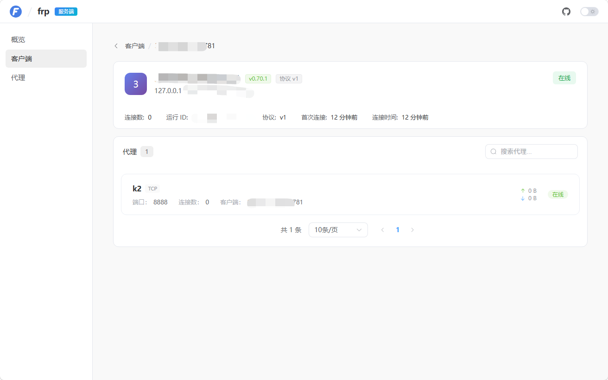
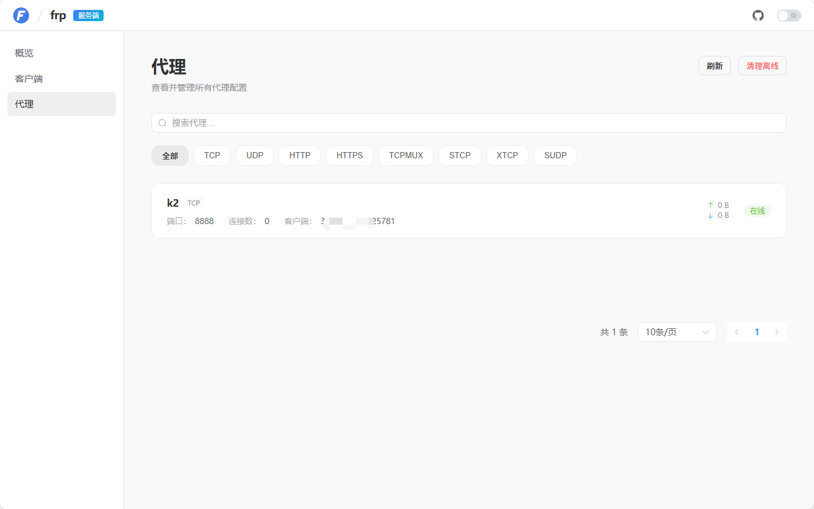
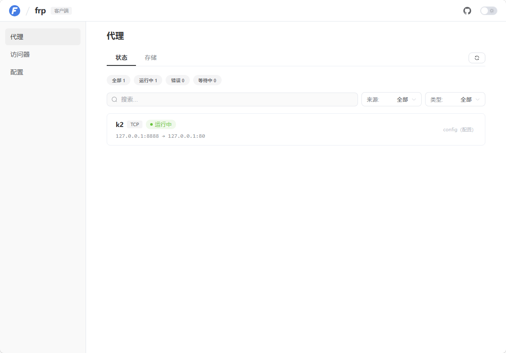
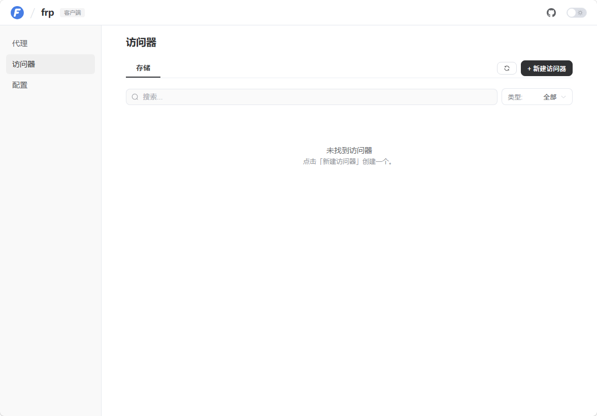

# frp v0.70.1 中文汉化版

> 基于 [fatedier/frp](https://github.com/fatedier/frp) v0.70.1，完成 frps Dashboard 与 frpc Web UI 的全面中文本地化。

[](https://github.com/effectlve/frp_zh-cn/releases/tag/v0.70.1)
[](LICENSE)

---

## 项目简介

本仓库对 frp v0.70.1 的 Web 管理界面进行了完整的中文汉化，便于国内用户部署、使用和运维。

- **frps Dashboard**：服务端管理面板，用于监控服务端状态、客户端连接和代理列表
- **frpc Web UI**：客户端管理面板，用于管理本地代理、访问器和配置

汉化覆盖所有面向用户的可见文本，包括导航菜单、表单标签、按钮、状态提示、确认对话框、空状态、时间显示等。

---

## 界面截图

### frps Dashboard

#### 服务端概览



#### 客户端列表



#### 客户端详情



#### 代理列表



### frpc Web UI

#### 代理列表




#### 访问器列表




---

## 下载与使用

### 下载地址

前往 [Releases 页面](https://github.com/effectlve/frp_zh-cn/releases/tag/v0.70.1) 下载对应平台的安装包：

### 启用 Dashboard

**frps**：在 `frps.toml` 中配置：

```toml
webServer.addr = "0.0.0.0"
webServer.port = 7500
webServer.user = "admin"
webServer.password = "your_password"
```

**frpc**：在 `frpc.toml` 中配置：

```toml
webServer.addr = "0.0.0.0"
webServer.port = 7400
webServer.user = "admin"
webServer.password = "your_password"
```

---

## 致谢

- 原项目：[fatedier/frp](https://github.com/fatedier/frp) - A fast reverse proxy to help you expose a local server behind a NAT or firewall to the internet.
- 感谢 frp 开源社区的所有贡献者

## License

本项目遵循原 frp 项目的 [Apache License 2.0](LICENSE) 开源协议。
